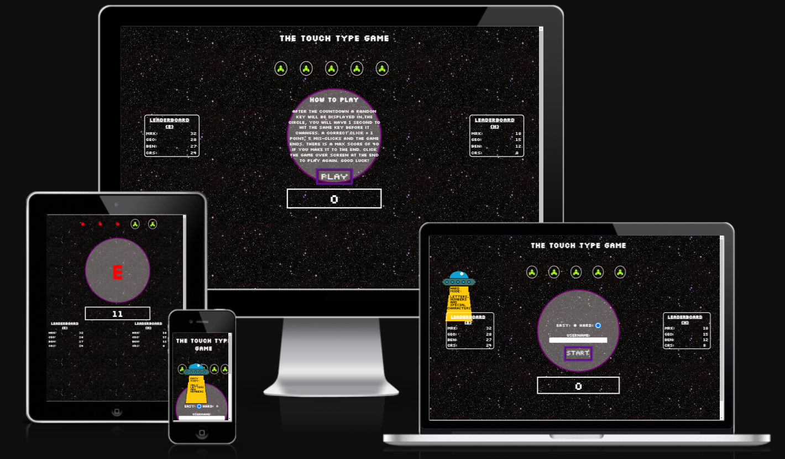
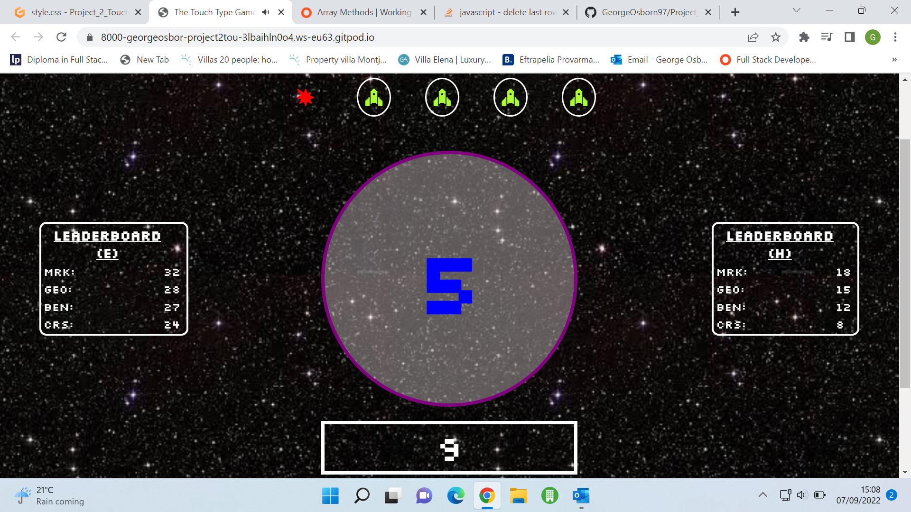
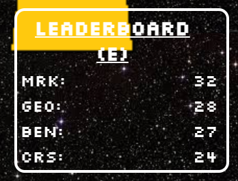
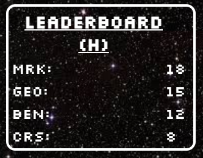

# THE TOUCH TYPE GAME

"THE TOUCH TYPE GAME" was designed to provide a fun training tool to those wanting to improve their ability to touch type. The Idea was to create a fun, useful, simple yet slightly challenging game that visually would be reminiscent of old arcade games (asteroids, space invaders etc...). The game contains two modes to test the skill of the user, the 'easy' mode contains only letters and numbers, 'hard' mode starts to incorporate special characters including those accessed by shift. THE TOUCH TYPE GAME aims to be useful to people of all ages looking to improve their ability to touch type.

Find a link to the deployed site [here](https://georgeosborn97.github.io/Project_2_Touch_type_Game/)

## contents:
1. [User experience](#user-experience)
   - [Mockup desings](#simple-initial-design-plans)
2. [Final product](#final-product)
   - [Before submission (Desktop)](#before-submission-desktop)
   - [After Submission (Desktop)](#after-submission-desktop)
   - [Whilst playing (Desktop)](#whilst-playing-desktop)
   - [After playing (Desktop)](#after-playing-desktop)
   - [Before submission (Mobile)](#before-submission-mobile)
   - [After Submission (Mobile)](#after-submission-mobile)
   - [Whilst playing (Mobile)](#whilst-playing-mobile)
   - [After playing (Mobile)](#after-playing-mobile)
3. [Features](#features)
   - [The background and imagery](#the-background-and-imagery)
   - [The audio](#the-audio)
   - [General formatting](#general-formatting)
   - [The Game-Screen](#the-game-screen)
   - [Scoreboards](#scoreboards)
   - [Score counter](#score-counter)
   - [Fail icons](#fail-icons)
   - [UFO](#ufo)
4. [Technology that was utilized](#technology-that-was-utilized)   
   - [Languages](#languages)
   - [External assets](#external-assets-utilized)
5. [Testing](#testing)  
   - [HTML W3C Validation](#html-w3c-validation)
   - [CSS Jigsaw validation](#jigsaw-validation)
   - [JShint Validation](#jshint-validation)
   - [Lighthouse](#lighthouse)
   - [Desktop results](#desktop-results)
   - [Mobile results](#mobile-results)
   - [Manual testing](#manual-testing)
   - [Device testing](#device-testing)
6. [Deployment](#deployment)
7. [Credits/Acknowledgments](#creditsacknowledgments)
   - [Content](#content)
   - [Media](#media)  
8. [Final thoughts](#final-thoughts)    
___
## User experience:
### What I wanted to achieve:

1. Create a fun and useful learning tool.

2. Create a game that will challenge the user regardless of their skill level.

3. Create a game that is replayable, allowing users to track their progress.

4. Create a game that through its visuals and audio reminds them of an old arcade experience. 

5. Create a game that can be played across desktop and mobile devices.

6. Create a game that provides the user a sense of accomplishment when they are finished playing.
___
### Simple initial design plans:
state | Mockup example |
--- | --- |
Initial |  |
Whilst playing |  |
___
## Final Product
### Before Submission (Desktop)

### After Submission (Desktop)

### Whilst Playing (Desktop)

### After Playing (Desktop)

### Before Submission (Mobile)

### After Submission (Mobile)

### Whilst Playing (Mobile)

### After Playing (Mobile)

___
## Features: 
### The background and imagery:
   - the background image aims to provide a fitting general setting for the site, whilst not distracting from the elements the user will have the most interaction with.
   - The background slowly zooms in as to give the site a sense of life. The speed of this effect was considered heavily as it could not distract the user from the game whilst they are playing.
   - The pixilated text, space theme of the background and icons were specifically choosen to provide a sense of nostalgia. They aim to be reminiscent of games such as space invaders and asteroids.   
### The audio: 
   - There is a background piece of music that begins after the user has submitted their name and difficulty. It follows the classic sci-fi game theme of the site and aims to begin to immerse the user.
   - Different sound effects are utilized throughout, the key ones are the 'fail' sound and 'correct' sound. These are present to give an audible cue within the game, but also to provide a bit of tension to the game.
   - All audio utilized is all in service of immersion and to make the game and by extension the site as a whole feel more alive and responsive to the user.
### General formatting:
   - To avoid distraction the 'game-screen' is front and center on all devices.
   - All user interactivity occurs within the 'game-screen' this is done specifically to keep consistency of where and how the key information is presented
   - All key elements have a border to help them stand out to the user. White is used consistently to provide contrast from the dark background. The only exception to this is the 'game-screen'. Its border is purple as are a many of the elements within. This is done to draw the users focus to it as although it's a darker color, It stands out against the rest of the elements. 
### The Game-Screen: 
   - The game-screen is the central div. It's formatted slightly differently from the rest of the elements in order to draw the user's attention.
   - Initially the game-screen contains a place for the user to input a name and the difficulty that they wish to play at. (the differences are specified to by the 'ufo')
   - After submitting a name the form is removed and replaced with a small title, a paragraph defining the rules of the game and a new button that starts the game.
   - When the play button is clicked the title turns into a five second countdown, after which the instructions are removed, the title is blown up and is replaced by a random key that the user needs to match to gain a point.
   - After the game the screen changes again to a winner or looser screen.
   - If the user clicks on the screen one final time their initially inputted name and their score is logged to the relevant table, and the original form is recreated.
   - A feature of the game screen that appears only on mobile is that an input appears once the game has begun. Although this was not my ideal scenario I could not find another way to generate the keyboard for the user on a mobile device. All my previous attempts to solve this issue can be found in the commits. This is an area that I would like to return to in the future as my skills develop further.
   
### Scoreboards:
   - There are two scoreboards to represent the different modes, easy and hard. The users name and score is logged to the relevant board on completion of the game and is then sorted into numerical order, highest to lowest.

     
### Score counter:
   - The counter that sits under the game-screen simply tacks the users score. For every successful click the counter increases by one. When the game ends the counter stops tracking the users key presses.
   
### Fail icons:
   - At the top of the page are 5 green spaceships. These icons were chosen specifically to match the theme of the game.
   - On a misclick the icons turn red, lose their border and become 'explosions'. If, all 5 turn red the game ends. This feature aims to create a sense of urgency within the user and give the game as a whole a sense of drama.
   
### UFO:
   - The UFO is an attempt at a creative way to set forward a small bit of key information.
   - The goal of this was to first of all set out the differences between the two modes and secondly to provide a striking opening image/effect that would grab the user as they enter the site.
   - Although the colours of yellow and white do contrast slightly (the ufo and the leaderboard) the UFO disappears on the submission of the name in order to keep all the elements clear.

   
___
## Technology that was utilized:
### languages:
* HTML5
* CSS3
* javascript
### external assets utilized:
* [GitHub](https://github.com/)
* [GitPod](https://gitpod.io/)
* [font awesome](https://fontawesome.com/)
* [google fonts](https://fonts.google.com/)
* [balsimq](https://balsamiq.com/)
* [amiresponsive](https://ui.dev/amiresponsive)
* [Pixilart](https://www.pixilart.com/draw?gclid=CjwKCAjw6raYBhB7EiwABge5Kr74ckPbOVND42OxyLYGYqnew4wkdbgsyGKaYj_KRU4xmjfZM03gExoCQHAQAvD_BwE)
* Chrome devtools
* Google images
* [W3C HTML validator](https://validator.w3.org/)
* [Jigsaw CSS validator](https://jigsaw.w3.org/css-validator/)
* [JShint Javascript validator](https://jshint.com/)
___
## testing:
In order to test responsive elements throughout the development process Chrome Devtools was used frequently.
### HTML W3C validation:
   - Apart from some small typo errors nothing was highlighted during HTML validation.
### Jigsaw validation:
   - No errors were highlighted during CSS validation at any stage.
### JShint validation:
   - No errors were highlighted during javascript validation at any stage.   
### Lighthouse:
#### Desktop results:
   - Index results

#### Mobile results:
   - Index results

### Manual Testing:
#### Feature Testing:
* Fixes refers to any potential current fixes/improvements that are still potentially available. 'None required' refers to the fact that at this moment there is no additional work needed to improve that feature. Many bugs and errors were encounted during the development process and several of these features were very much trail and error. The accounts of which can be found throughout the commits in GitHub.
* Background image: 
   - What was expected? The background image should not be distracting, in focus and on desktop the image should slowly zoom in for a period of 5 minutes before resetting.
   - How it was tested? The site was given to a number of people to gauge their reactions, none of them stated that they were distracted by the background whilst playing the game. The zoom effect was also watched to completion to ensure that it did reset after 5 minutes.
   - What was the outcome?
   The background worked as intended. it provides a fitting setting for the game whilst not distracting the user.
   - Fixes? None required.
* audio plays at the correct time:
   - What was expected? All audio plays and ends as and when it's required.
   The background music starts after the user has inputted their name and difficulty.
   On a correct click the expected audio file is called, likewise on a misclick the expected audio file is called.
   On completion of the game one of two sounds play depending on the outcome of the game.
   When the UFO image reenters a subtle effect can be heard.
   - How it was tested? Each function that calls forth an audio file was specifically triggered in order to test that the sound does play.
   - What was the outcome? On all testing the correct files are played at the correct time.
   - Fixes? All audio does play correctly however, On rapid key presses during the game the correct and fail sounds can be effected and not always play at the correct time. Also the UFO effect is very quiet and is easily masked by the background music. These issues aren't game breaking and I believe are due to the Length of the audio track and the volume of the audio track respectively. As they are not game breaking and if the user interacts with the game as intended their effect is very minimal.
* Users name input:
   - What was expected? The inputted name would be pushed onto the end of an array to be recalled once the game has ended.
   - How it was tested? Console.log was used to show the new array on the event that the submit button was pushed.
   - What was the outcome? The new name inputted by the user appeared as the last name in the array in the console.
   - Fixes? None required.
* Difficulty selector:
   - What was expected? When a difficulty is selected it is pushed to an array so that it can be used to determine which array of keys to call during the game and which table to publish the result to.
   On mobile the hard mode should not be able to be selected.
   - How it was tested? Console.log was used to show the new array on the event that a difficulty was selected. the game was then played to ensure the correct array of keys was selected.The site was then loaded on chrome dev tools to simulate a mobile and ensure that hard mode was not able to be selected.
   - What was the outcome? The correct difficulty was pushed to the array, the correct keys were shown during the game and the hard mode was not accessible on mobile devices.
   - Fixes? None required.
* The removal of the form on submit:
   - What was expected? After the user has interacted with the submit button the form is removed and replaced with a h1 and a p element that display the instructions of how to play the game and a new button to start the game.
   - How it was tested? The submit button was clicked.
   - What was the outcome? The form was removed and all the new elements were added correctly with the correct styling.
   - Fixes? None required.
* The countdown starts on play:
   - What was expected? When the play button is interacted with, the h1 elements content changes to a 5 and then reduces by 1 in set interval until it hits 0 where in the p is removed, and the title is restyled and says 'GO!'.
   - How it was tested? The play button was clicked.
   - What was the outcome? The Countdown initiated as expected and at the end of the countdown the relevant elements were removed and or restyled correctly.
   - Fixes? None required.
* The function to display random keys works as expected.:
   - What was expected? After the countdown a total of 40 random keys relevant to the difficulty selected is shown in the main game screen every second. Every new key shown the element should change colour from red to blue and back to red.
   - How it was tested? The game was played multiple times on both difficulties.
   - What was the outcome? The keys shown are random and change colour every interval as intended. On easy mode the correct array is called and only letters and numbers are called. In Hard mode the correct array is called, letters, numbers and certain special characters are called.
   - Fixes? None required.
* The key tracking works for correct clicks and wrong clicks:
   - What was expected? If the user pushed the matching key to that on the screen the counter underneath would increase by 1. If the key was incorrect then the counter should not change, one of the fail counters above should turn from green to red, and the respective audio should play.
   - How it was tested? The game was played through many times testing different scenarios.
   - What was the outcome? The counter logged every correct click and the fail counters logged every wrong click correctly.
   - Fixes? There are two potential issues that could be addressed. The first is that if the user is fast enough then they can double click and gain +2 to their score. One solution to this was to call the newKey() function on a correct click but this effected the interval and caused an unplayable scenario. This still requires looking into. 
   The other potential issue is that when playing hard mode when shift is pressed the fail icons do not register a misclick. This is an issue as for the whole game shift can be held and the user can get through with no misclicks. However when shift is pressed unless it's required for certain special characters the counter does not add +1 to their score. In my opinion although this is a bug within the game it makes the hard mode more forgiving and more playable. This bug is also caused by the fix that was inputted so that the shift key did not register as a misclick when it's required to reach a special character. Therefore although the shift key negates the fail count I am of the opinion that it works on favour of the game, making it a more playable and better experience for the user.
* Gameover is produced after 40 keys or 5 misclicks:
   - What was expected? After 40 keys are shown the endGame() function is called. The h1 element is removed and a background image is set in the game screen.
   - How it was tested? The game was allowed to run until the 40 keys were shown. The game was then played and the 40 key mark was reached, the game was played and purposely lost before the 40 keys.
   - What was the outcome? The endGame() was called after both ending scenarios. The title was removed in both instances likewise a new background image was placed in the game screen.
   - Fixes? None required.
* One of two images and audio files is placed/played in the game screen depending on the score:
   - What was expected? If the score equalled 40 the a winning image is shown and a cheer is played, if the score is less than 40 then a gameover image is shown and a crash is heard.
   - How it was tested? The game was played and allowed ended before the score reached 40, the game was played again to reach the 40 score cap.
   - What was the outcome? In Both instnaces the relevent image and audio file were called.
   - Fixes? None required.   
* Remake the inital conditions on reset:
   - What was expected? After clicking the game screen when the game ends the initail conditions are recreated. The form is remade, the fail icons are reset to green, and the score is set to 0.
   - How it was tested? After playing through the game the game over screen was clicked.
   - What was the outcome? All of the changes required occur without incident. The form is recreated and the counters are all reset. 
   - Fixes? None required.
* Addition of users name and score to the relevent table:
   - What was expected? when the game ends the name the user inputted and their score is added to the table relative to the difficulty they selected.
   - How it was tested? The game was played through multiple times on both difficulties.
   - What was the outcome? When the game ends the users name and score are both added to the relevent table.
   - Fixes? None required.
* Table change on mobile:
   - What was expected? When the site is loaded on mobile the tables are remade in index.html to better fit the smaller screen.
   - How it was tested? the site was simulated on mobiles using chrome dev tools.
   - What was the outcome? The tables are remade underneath the game screen when the site is loaded on mobiles.
   - Fixes? None required.
* Removal of title whilst playing on mobile:
   - What was expected? When the countdown reaches 0 and the game starts the title of the site is removed on mobile devices.
   - How it was tested? The game was played on mobile devices.
   - What was the outcome? The title does get removed during play on mobiles and is remade on the resetting of the intial conditions.
   - Fixes? None required.
* An input is created on mobile during the game:
   - What was expected? When the game is played on mobile devices an input is created inbetween the counter and game screen
   - How it was tested? The game was played on mobile devices.
   - What was the outcome? The input was created on mobile devices when the agme starts.
   - Fixes? None required.
* UFO fades in and out as required:
   - What was expected? On the loading of the site a portal image fades out as a UFO fades in and scales up. When the form is submitted the ufo fades out. When the inital conditions are recreated the UFO fades back in. The UFO acts as a way to inform the user the differences between the modes by chnaging depnding on which mode is selected.
   - How it was tested? The game was loaded and played through on multiple devices. The two modes were both selected on various occasions.
   - What was the outcome? The UFO does fade in and out as required and shows the relevent information depending on which mode is selected.
   - Fixes? A lot of work went into creating this effect, a lot of trial of error for the many issues that were encountered through out the development, all of which can be seen in the commits.
* All hover effects.
   - What was expected? When the curser is moved over the start button, play button and game over screen the images are scaled up. When the curser moves out they scale backdown.
   - How it was tested? The curser was moved in and out of all three of these elements.
   - What was the outcome? All three of these elements responded as expected when the curser was moved in and out of the elements.
   - Fixes? None required.   
#### Device testing:
This site has been physically tested on:
   - ASUS ZenBook
   - Iphone X
   - Samsung Galaxy S20

After the initial deployment these are the bugs that needed addressing:
   1. The UFO was loading off screen on mobile. This was solved by floating the box div over to the left and reducing it to 1px by 1px.
   2. There was an oversight as I did not initially think of how I was going to open the keyboard on mobile. There was many attempts at ways to force open the keyboard but they did work unfortunatly. In the end the fix for this was to create an input that the user could interactive with to open the keyboard on mobile.
   3. The input that was made in order to force open a mobile keyboard had one big issue. The screen zoomed in on the input when it was selected. The user was then required to zoom back out or scroll up to see the keys to be pressed. I have since put in a maximum-scale into the viewport meta, this has stopped the zooming effect.
   ___
## deployment:
All code was written in Gitpod, pushed to GitHub and deployed to GitHub Pages.

In order to deploy our site from GitHub to Github pages the stages are as follows:

   1. From the repostories page in GitHub select the project that needs to be deployed.
   2. go to settings then on the right hand side menu select pages.
   3. within this page go to the souce dropdown and select "main" then select save.
   4. from here the link appears to our deployed site.   
___
## credits/acknowledgments
### Content:
- The vast majority of the code was written by myself with the exception of two instances where external code was copied in to this webpage however these were modified slightyly to fit my sepcific needs. Stackoverflow and was used regulary in order to gain a better understanding of how certain elements interact and best practices for implementation. As well as w3Schools which provided base code for the movement of the 'ufo' and the sorting of the table. Both these codes were modified by me to suit my needs. The two base codes can be found here for the ufo movement and the table sort: [Table](https://www.w3schools.com/howto/howto_js_sort_table.asp) [ufo](https://www.w3schools.com/js/js_htmldom_animate.asp)
- All icons are from [Font awesome](https://fontawesome.com/icons)
- the font used was imported from Google fonts and created by Jason Kottke it can be viewed [here](https://fonts.google.com/specimen/Silkscreen?query=silk)

### Media:
- The background image and two gameover images used in this site were taken from Google Images.
- The buttons, 'UFO' and Portal were created by me using [Pixilart](https://www.pixilart.com/draw?gclid=CjwKCAjw6raYBhB7EiwABge5Kr74ckPbOVND42OxyLYGYqnew4wkdbgsyGKaYj_KRU4xmjfZM03gExoCQHAQAvD_BwE)
- The Mock up and wireframes were created using both [amiresponsive](https://ui.dev/amiresponsive) and [Balsamiq](https://balsamiq.com/) respectivly.
___
## Final thoughts
Message for the assessor; LO2 2.4 says 'all external links open to a seporate tab.' I just wanted to leave a note to explain that I purposly made the decision to exclude any would be links as I didnt feel like they would match the aesthetic of the site and I didn't want to include them for including thems sake. 
This was an extreamly challenging project to take on, however it is one I am very proud of.
A big thank you to Marcel my mentor Marcel and the whole Code Institute team for their amazing support.
I hope you enjoy my game.